## Hi there 👋

<!--
**parrais/parrais** is a ✨ _special_ ✨ repository because its `README.md` (this file) appears on your GitHub profile.

Here are some ideas to get you started:

- 🔭 I’m currently working on ...
- 🌱 I’m currently learning ...
- 👯 I’m looking to collaborate on ...
- 🤔 I’m looking for help with ...
- 💬 Ask me about ...
- 📫 How to reach me: ...
- 😄 Pronouns: ...
- ⚡ Fun fact: ...
-->

### My Coding Skills

### My GitHub Metrics

### Previous Experience

- 🎓 Graduate in Mathematical Sciences from [The Queen's College](https://www.queens.ox.ac.uk/), [Oxford University](https://www.ox.ac.uk/).
- 🏢 Over twenty years of IT project management in industry (including financial and manufacturing sectors).
