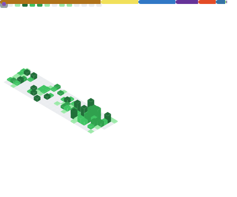

## About Me

- 🧑‍💻 I am excited to be starting out on my new career as a junior software/devops engineer!
- 📖 I am also continuing to practice and build on the skills I've learned on my journey so far.

## My Coding Skills

### Front-end

- 
  
- 
  
  

### Back-end

- 
  
  
- 
  
  
- 

### DevOps

- 
  
- 
  
- 

### Tools

- 
  
  

## My Previous Experience

- 🏫 Completed a **Software Development Bootcamp in JavaScript** with [Northcoders](https://www.northcoders.com/) in 2025.
- 🎓 Graduate in Mathematical Sciences from [The Queen's College](https://www.queens.ox.ac.uk/), [University of Oxford](https://www.ox.ac.uk/)
- 🏢 Over twenty years of IT project management in industry (including financial and manufacturing sectors)

## My Other Activities

- 👟 Running to keep fit; I also aim to run [parkrun](https://www.parkrun.org.uk/) every Saturday morning
- 🎮 Keen gamer, including PC games (modern and retro) and German-style board games
- 🖥️ Tinkering in tech e.g. building PCs for family
- 👨‍👩‍👧‍👧 Father of two teenagers
- 🐈 Owner (or owned by) two cats
- 🐏 Long-suffering supporter of Derby County FC

## My GitHub Metrics

